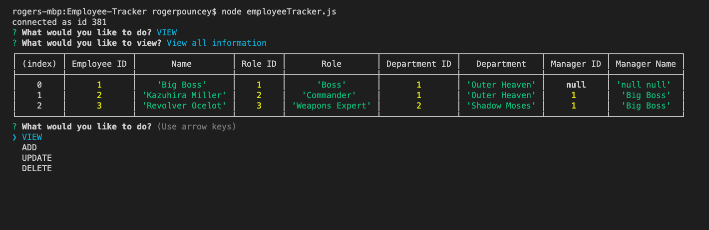
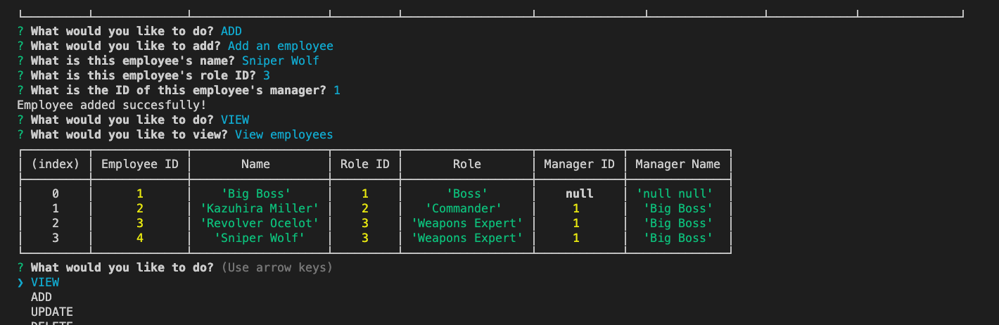
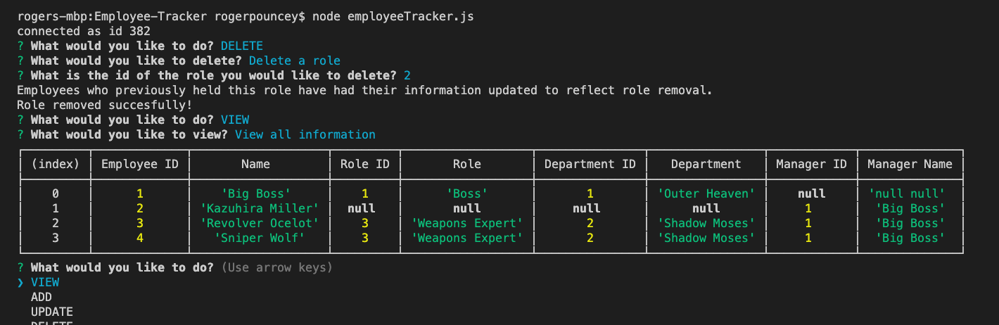

# Employee-Tracker

### **by Roger Pouncey** 

A command line content management system that uses Node, Inquirer, and MySQL to manage employee information.

Email: rpounceyjr@gmail.com

## **Table of Contents** 

#### i. [Installation](#installation)

#### ii. [Usage](#usage)

#### iii. [Contributing](#contributing)

#### iv. [Tests](#tests)

#### v. [Questions](#questions)

## **Installation** 
 
                $ npm i

## **Usage** 

This command line application can be used to create, delete, and update employee records.  Upon starting the application, users are prompted to VIEW, ADD, UPDATE, or DELETE.  After chosing one of these options, users are given the option to perform the chosen action for a department, role, or employee.  

After choosing the category that they would like to view, add to, update, or delete from, users are prompted with a series of questions about the specific department/role/employee they would like to modify.  

After this information is received from the user, it is passed into a query which is sent to a MySQL database.  The database is modified according to the information the user provided.

A note on deletions: when deleting a table row, this app DOES NOT delete affected rows in child tables, but rather updates the affected information in the child tables to a null value.  For instance, if the user deletes a department, roles which belonged to that department would not be deleted.  The app assumes that the role will simply be updated and reassigned to a new department.  

## **Contributing** 

This project was created by Roger Pouncey.  Improvements can be made to the app by making a pull request on GitHub.

## **Tests** 

No tests were performed on this app.

## **Questions** 

Questions about this app can be addressed to Roger Pouncey, either through GitHub or via the above email address.